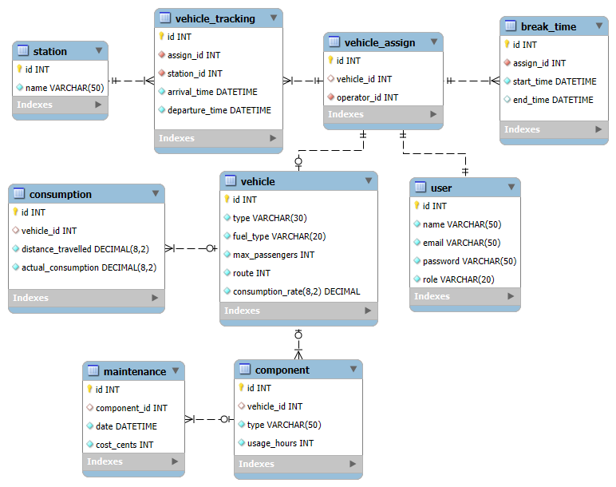
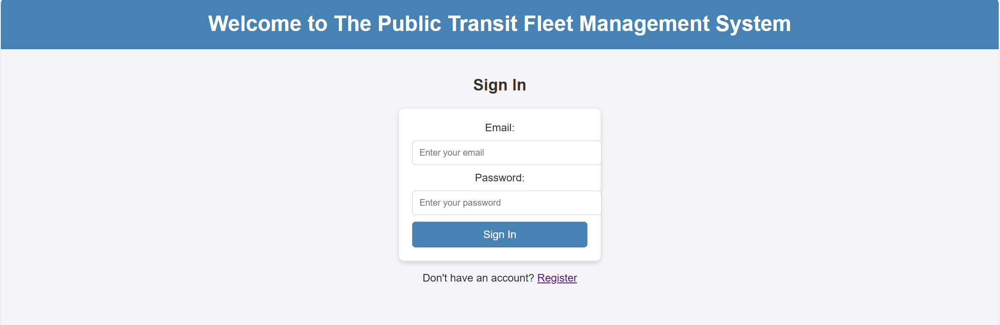

# CST8288 Final Project

## Entity Relationship Diagram (ERD)

•	Streamlined transit operations by applying Java Servlets, MySQL, and 3-tier architecture, resulting in a web-based platform for managing buses, light rail, and diesel-electric trains  

•	Enhanced system functionality by integrating DAO, Simple Factory, Observer design patterns, enabling maintainable code with clear separation of concerns

•	Completed core features using Java Servlets, JDBC, and SQL for user authentication, vehicle management, GPS tracking, and break logging, resulting in a functional transit management system

